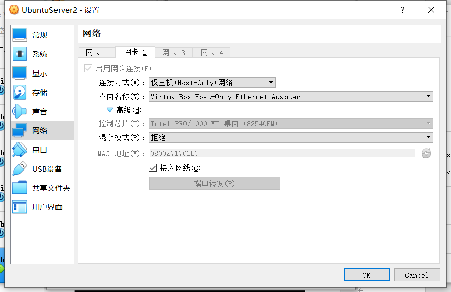

# **分布式系统与云计算作业1**


## **一、安装Ubuntu Server 20.04**
 


## **二、配置网络**

网卡1使用“桥接网卡”，并选择对应的电脑网卡；并在高级设置中的混杂模式选择“全部允许”
 


网卡2连接方式选择“仅主机网络”
 


## **三、命令行配置**

安装网络工具net-tools

```
sudo apt install net-tools
```

 


通过ifconfig命令查看虚拟机guest的主机地址

```
ifconfig
```

 


在host主机端调出CMD命令提示符，查询host主机的IP地址

```
ipconfig
```

 


在虚拟机中的guest主机中尝试ping通host主机

```
ping 192.168.43.85
```

 


在host主机ping通虚拟机的guest主机

```
ping 192.168.31.160
```

 


## **四、开通与使用http server服务**

虚拟机中的guest主机复制GitHub中的hmtl样式

```
git clone https://github.com/zxuqian/html-css-examples.git
```

 


在guest主机开通http server服务

```
python3 -m http.server --directory html-css-examples 8005
```

 


在host主机通过浏览器访问guest主机地址
192.168.31.160:8005
 

