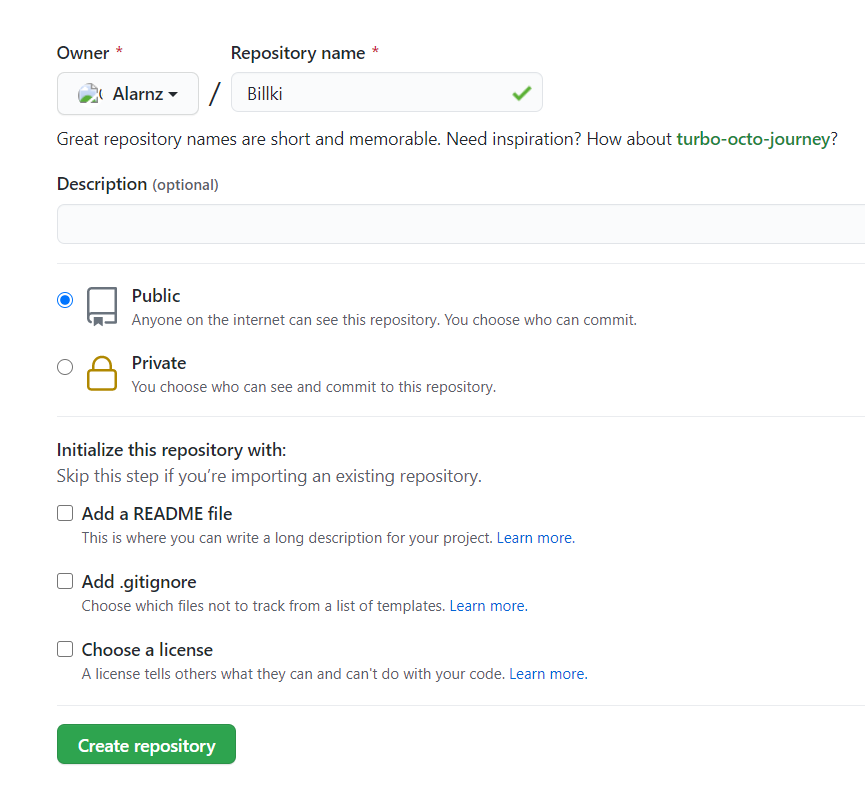
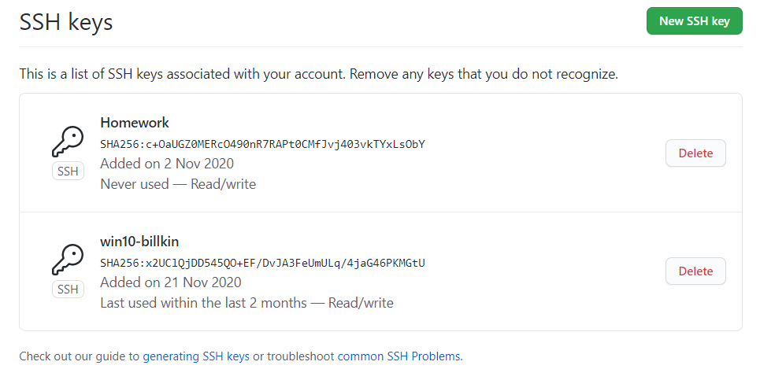
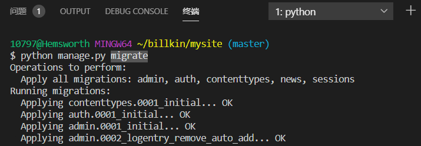
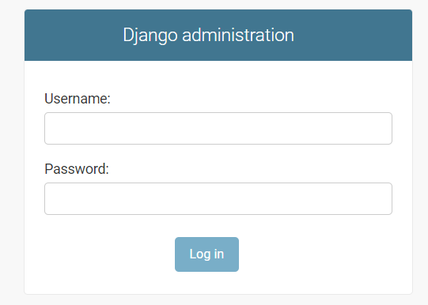
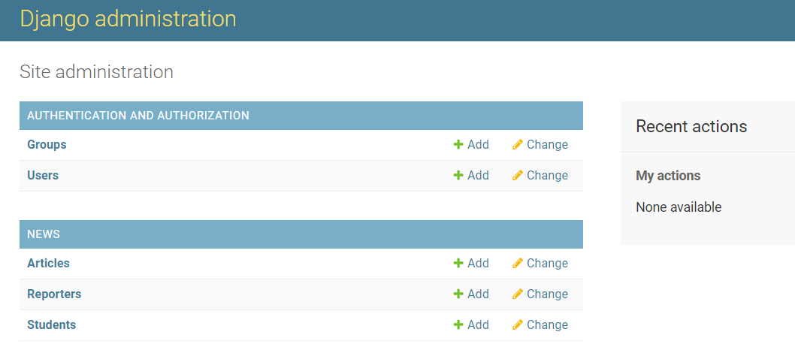
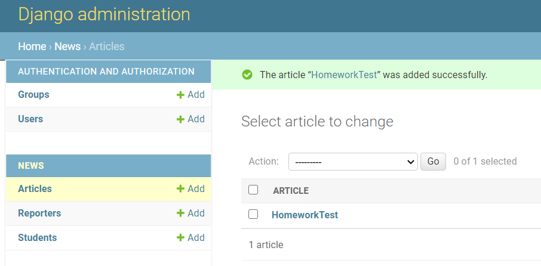
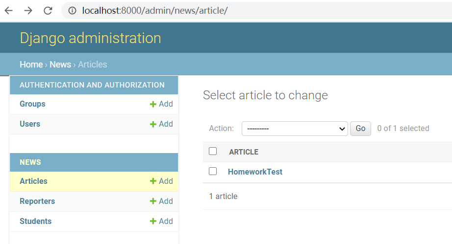
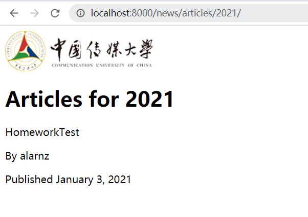
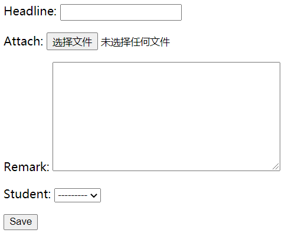

# 作业2：云盘系统

## 一、环境配置
#### 1.创建github仓库
  
#### 2.本地产生公私钥对
`ssh-keygen`
#### 3.将本地~/.ssh/id_rsa.pub文件中的证书复制到github服务器的ssh秘钥中
   
#### 4.将github端的仓库克隆到本地
`git clone`

## 二、Django程序编写
借助Django文档编写Django
https://docs.djangoproject.com/en/3.1/
#### 1.初始文件创建
在仓库创建mysite文件夹，子目录下创建mysite、news、polls文件夹，并创建数据库db，其中sqlite3与pyc格式的文件加入屏蔽名单gitignore
#### 2.安装数据库sqlite3
通过数据迁移命令将数据迁移到数据库
`python manage.py migrate`
   
#### 3.admin页面的编写
创建superuser帐号，建立后台数据管理页面
   
     
       
 
 
#### 4.news页面的编写
通过urls文件编写网页地址，views文件确定网页效果，templates文件确定html网页样式
在admin/news/artile/路径下添加文章，通过news文件夹下的artiles/int:year>/路径访问选定年度文章
例：
   
     
 
#### 5.文件上传页面的编写
增加文件上传的类HomeworkCreate，创建作业提交网页样式
   